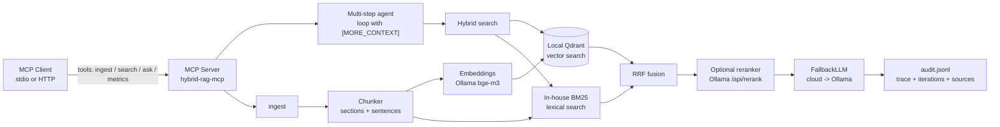

# hybrid-rag-mcp

[](https://github.com/brenol404/hybrid-rag-mcp/actions/workflows/ci.yml)
[](https://www.python.org/)
[](LICENSE)
[](https://github.com/brenol404/hybrid-rag-mcp/releases)

> MCP server with **hybrid RAG** (vector Qdrant + lexical BM25 via RRF), a **multi-step agent** with offline fallback via **Ollama**, and **stdio** or **streamable HTTP** transport.

Focus: index technical documents (Markdown, TXT, PDF) and answer questions with **cited sources**, **100% locally**, without sending documents to third parties.

> **Evidence:** recall@1 **0.917** · answer judge **1.92/2** · **80 tests** · mypy strict · CI with quality gates.

**Leia em [português](README.pt-BR.md).**

## Contents

- [Highlights](#highlights)
- [Architecture](#architecture)
- [Metrics](#metrics-quality-gate-in-ci)
- [Answer quality](#answer-quality-llm-as-judge)
- [Scale](#scale-retrieval-embedded-mode)
- [Context optimization](#context-optimization-cache-and-compression)
- [Corpus](#corpus)
- [Running](#running)
- [Deploy](#deploy)
- [Observability](#observability)
- [MCP tools](#mcp-tools)
- [Structure](#structure)
- [Quality](#quality)

## Highlights

- **Hybrid search**: embeddings (local Qdrant, no Docker) + in-house BM25 (smoothed idf), fused by **RRF**.
- **Multi-step agent**: if the first search's context is insufficient, the model signals `[MORE_CONTEXT]`, the agent issues a follow-up search and retries with **incremental source memory**.
- **Optional re-ranking**: cross-encoder (Ollama `/api/rerank`, e.g. `bge-reranker-v2-m3`) with *graceful degradation*.
- **Resilient fallback**: cloud provider (OpenAI-compatible) first, **local Ollama as backup** when the API is down.
- **Persistence**: chunks live in Qdrant; the BM25 index is **restored on demand** (first search) with no re-ingestion.
- **Incremental ingestion**: re-running `ingest` only embeds what changed (content-hash idempotent) and prunes orphans — cheap in CI and redeploys.
- **Token optimization**: **semantic cache** (JSONL + cosine, with TTL) returns previously generated answers without re-calling the LLM; a **Caveman-style compressor** (PT/EN) trims the source context before the prompt.
- **Traceability**: per-step agent `trace` + `audit.jsonl` (question, provider, iterations, latency, sources, cache).
- **Measurable**: `recall@k` / `nDCG@k` evaluation pipeline with a **quality gate in CI**.
- **Two transports**: stdio (local RPC) and **streamable HTTP** (`http://host:port/mcp`).

## Architecture



## Metrics (quality gate in CI)

Evaluation pipeline over **36 queries** — 12 hand-curated in `eval/dataset.jsonl` + 24 auto-generated from real documents (`eval/dataset.real.jsonl`, see [Corpus](#corpus)).
CI trigger: **fails if `recall@1 < 0.8`**.

| k  | recall@k | nDCG@k |
|----|----------|--------|
| 1  | **0.917** | 0.917 |
| 3  | **1.000** | 0.865 |
| 5  | **1.000** | 0.945 |

Honest numbers over real text: the right source ranks top-1 in 91.7% of cases and always in the top-3. `tools/grid_search.py` sweeps RRF weights/top_k to reach this result (lexical weight 1.5) — history in `eval/grid_results.json`. Run locally with `python -m hybrid_rag_mcp.eval`.

## Answer quality (llm-as-judge)

Retrieval proves the right chunk surfaces; this proves the final answer is correct:
**12 questions** over the corpus (`eval/answers.jsonl`), each with an expected
answer, scored **0/1/2** by Ollama itself — run with
`python -m hybrid_rag_mcp.judge` (needs Ollama up).

| metric | value |
|---|---|
| average | **1.92** (0..2) |
| score 2 | 11/12 |
| score 1 | 1/12 (ans-06: missed "telemetry doesn't go to PostgreSQL") |
| score 0 / no verdict | 0 |

## Scale (retrieval, embedded mode)

Methodology (`tools/scale_bench.py`): 11 real docs replicated with unique salt
up to ~25k chunks — recall stays on the curated eval; here only **latency,
throughput and disk** (36 real queries, no LLM). Isolated index, embedded
Qdrant on a 4GB RAM box.

| metric | 32,760 indexed chunks |
|---|---|
| ingest | 566s (**58 chunks/s**), 337MB index on disk |
| 1-thread search | p50 269ms · p95 663ms · mean 404ms |
| 8-thread search | p50 1313ms · p95 2334ms |
| p99 single 4.4s | one-time warmup cost (first search restores the BM25 index) |

Honest readings: the bottleneck at scale is **pure-Python BM25** (scans every
doc per query) plus contention under concurrency (~5x with 8 threads — GIL +
local Qdrant + embedding on Ollama). Known ceiling: at 128k chunks the box
OOMed — above ~100k chunks or on little RAM, use server mode
(`QDRANT_URL`, see Deploy).

## Context optimization (cache and compression)

**Semantic cache** — before generating, `ask` consults `data/cache.jsonl` in two layers:
1. *exact normalization* (identical questions, ignoring case/whitespace) and
2. *similarity* — the question is embedded (same bge-m3 as search) and compared
   by cosine against the entries; above `CACHE_SIM_THRESHOLD` (0.92) the saved
   answer is returned (TTL `CACHE_TTL_SEC`, `CACHE_MAX_ENTRIES` cap). A hit skips
   generation entirely — the biggest token saving. Hits are marked `· cache` in
   the answer and recorded in the audit (`"cache": true`).

**Caveman-style context compression** — `CONTEXT_COMPRESSION` (0/1/2) removes
predictable function words (connectives/fillers at level 1; + articles and
auxiliaries at level 2) **only from the copy that goes into the LLM prompt**:
search, re-ranking and displayed sources keep the original text, and numbers,
proper nouns and negations are never removed. Deterministic, multilingual
(PT/EN), zero dependencies.

```bash
python tools/optimizers_report.py        # dashboard: cache + compression + evaluated integrations
python tools/optimizers_report.py --json # same output as JSON
```

**Evaluated external integrations — kept optional (nothing enters the core):**

| Tool | Where it would fit | Verdict |
|---|---|---|
| [Headroom](https://github.com/headroomlabs-ai/headroom) | reversible compression of context/tool outputs/RAG chunks; own Python lib + MCP server | adoptable later as MCP sidecar; ONNX/HF load (`pip install headroom`) |
| [RTK](https://github.com/rtk-ai/rtk) | shell-output compression for coding agents | outside the runtime — recommended in the dev environment |
| [Caveman](https://github.com/wilpel/caveman-compression) | "strip grammar, keep facts" principle (PT included) | **already embedded** in `CONTEXT_COMPRESSION` |
| [Ponytail](https://github.com/DietrichGebert/ponytail) | cutting the volume of agent-generated code | doesn't apply to a RAG server |

## Corpus

- `examples/corpus/` — **11 documents**: 5 fictional (operations/security/database/infra/events) + 6 real public-domain books (Project Gutenberg): Chekhov, Machado de Assis, Aluísio Azevedo, Eça de Queirós, Jane Austen and Conan Doyle, mixing PT and EN.
- `tools/fetch_corpus.py` — downloads the Gutenberg catalog and **auto-generates the evaluation dataset**: each query is a real excerpt from a document and the expected document is that excerpt's exact source (self-supervised ground truth, no manual curation).

## Running

Prerequisites: **Python 3.11+**, running **Ollama** (`ollama serve`).

```bash
# 1. Local models (once)
ollama pull bge-m3        # embeddings
ollama pull qwen3:8b      # generation (or another)
ollama pull bge-reranker-v2-m3   # optional: Ollama >= 0.36 only

# 2. Install
python -m venv .venv && source .venv/bin/activate
pip install -e ".[dev]"

# 3. ~1 min demo (ingest + search + ask)
bash examples/demo.sh
```

<details>
<summary>Real demo output (local Ollama, example corpus)</summary>

```
[ingest] 11 docs, 1964 chunks (+0 novos, 1964 no índice)
[search] 'Qual a porta padrão do servidor?'
  - [pqpbr-operations.txt] score=0.065: ## Configuração de Rede O servidor escuta na porta 8443...
[ask] 'De quantas em quantas horas são os backups?'
  [ollama/qwen3:8b] Os backups incrementais são executados a cada 4 horas [pqpbr-operations.txt].
  fontes: gutenberg-dom-casmurro.txt, pqpbr-operations.txt
```

</details>

### As an MCP client

**stdio:** example client — `python examples/client.py "Qual a porta padrão?"`

**Progress streaming (tokens + steps):**
`python examples/client_stream.py "Qual a política de manutenção do banco?"` — the server
emits step events and response tokens in real time via `notifications/progress`
(the client sends a `progressToken` in the request).

**HTTP:**

```bash
# terminal 1
python -m hybrid_rag_mcp --transport http --host 127.0.0.1 --port 8000

# terminal 2
python examples/client_http.py "Qual a porta padrão?"
```

**HTTP auth (recommended when exposing on a network):** generate a token
(`openssl rand -hex 32`), export `MCP_AUTH_TOKEN` on the server **and** the
client — without the `Authorization: Bearer` header the server answers 401.
With no token configured, it behaves as before (localhost only).

```
MCP_AUTH_TOKEN=... python -m hybrid_rag_mcp --transport http --port 8000
MCP_AUTH_TOKEN=... python examples/client_http.py "Qual a porta padrão?"
```

Register in any MCP client (Claude Desktop, editors, agents):

```json
{
  "mcpServers": {
    "hybrid-rag": {
      "command": ".venv/bin/python",
      "args": ["-m", "hybrid_rag_mcp"],
      "env": { "PYTHONPATH": "src" }
    }
  }
}
```

### Cloud fallback (optional)

Copy `.env.example` to `.env` and fill in `CLOUD_BASE_URL` + `CLOUD_API_KEY` + `CLOUD_MODEL`
(any OpenAI-compatible endpoint). Cloud takes priority; Ollama answers automatically
if the API fails or goes offline.

## Deploy

**systemd (bare metal):** `deploy/hybrid-rag.service` is a user unit that brings
up the HTTP transport on `127.0.0.1:8000` with automatic restart — adjust the paths
(`%h` = your home) and install with
`systemctl --user enable --now` pointing at the file. `.env` is optional
(cloud/token only if you export them).

**Docker (Qdrant + RAG):** `docker compose up -d --build` brings up Qdrant and the
server already pointed at it (`QDRANT_URL=http://qdrant:6333`, Ollama via
`host.docker.internal`). No Docker installed here so the compose was not run
locally — validated by inspection; CI keeps covering embedded mode.

**Data hygiene:** `audit.jsonl` rotates by size
(`AUDIT_MAX_BYTES`, default 5MB, keeps `AUDIT_KEEP=3` backups); the semantic
cache is already capped (`CACHE_MAX_ENTRIES`).

## Observability

In-process metrics, zero dependencies (`src/hybrid_rag_mcp/metrics.py`):
counters (`search_total`, `ask_total`, `ask_cache_hits`, `*_errors`,
`ask_provider_<name>`) + latencies (`search_ms`, `ask_ms`, `ingest_ms`).

- **HTTP:** `GET /metrics` in Prometheus format (inherits the bearer auth).
  Scrape example:
  ```yaml
  scrape_configs:
    - job_name: hybrid-rag
      static_configs: [{targets: ["127.0.0.1:8000"]}]
      # authorization: {credentials: <MCP_AUTH_TOKEN>}  # if auth is on
  ```
- **Both transports:** `metrics` MCP tool with a human summary.
- **Logs:** one JSON line per `search`/`ask` on stderr
  (`{"op": "ask", "elapsed_ms": 123.4, "cache_hit": false, ...}`) — stdout
  belongs to the MCP protocol in stdio mode and is never polluted.

## MCP tools

| Tool    | Description |
|---------|-----------|
| `ingest` | Indexes `md`/`txt`/`pdf` from a directory into both indexes (Qdrant + BM25). Incremental: only re-embeds changed chunks. |
| `search` | Hybrid search (RRF, optional re-ranking) returning snippets + sources. |
| `ask`    | Multi-step agent: retrieves, generates, detects insufficient context, re-searches and answers citing sources (with audit log). Consults the **semantic cache** before generating. |
| `metrics` | Server metrics summary (counters + p50/p95 latencies since boot). |

## Structure

```
src/hybrid_rag_mcp/
├── server.py          # MCP server (stdio + streamable HTTP, optional bearer auth)
├── config.py          # .env configuration (pydantic-settings)
├── eval.py            # recall@k / nDCG@k evaluation
├── judge.py           # Answer evaluation via llm-as-judge (score 0/1/2)
├── bench.py           # Scale-bench blocks (percentiles, synthetic corpus)
├── metrics.py         # In-process metrics (counters + p50/p95, Prometheus)
├── rag/
│   ├── agent.py       # Multi-step loop (source memory, [MORE_CONTEXT])
│   ├── chunker.py     # Chunking by markdown sections + sentences
│   ├── engine.py      # Orchestration: ingest → search → ask + audit
│   ├── hybrid.py      # RRF fusion + re-ranking
│   └── ingestion.py   # md/txt/pdf reading
├── providers/
│   ├── embed.py       # Embeddings via Ollama
│   ├── llm.py         # FallbackLLM (cloud → Ollama)
│   └── rerank.py      # Optional cross-encoder (graceful degradation)
├── optimize/
│   ├── cache.py       # Semantic cache (JSONL + cosine + TTL)
│   └── compress.py    # Caveman-style compressor (PT/EN)
└── stores/
    ├── vector.py      # Embedded Qdrant (no Docker, persistent)
    └── lexic.py       # BM25 with smoothed idf
```

Architecture decisions with context and evidence: [`docs/adr/`](docs/adr/)
(RRF, storage, cache, judge, lazy-init). Contributing guide: [CONTRIBUTING.md](CONTRIBUTING.md).
Release history: [CHANGELOG.md](CHANGELOG.md).

## Quality

- **80 unit tests** (`pytest`) with no network/Ollama — chunking, RRF, BM25, persistence, eval metrics, agent loop, semantic cache, compressor, lexical-index thread-safety, judge parsing/aggregation, HTTP auth, audit rotation and observability.
- CI in 2 jobs: `test` (ruff + **mypy strict** + pytest with ≥75% coverage + `pip-audit` + stdio/HTTP smoke) and `eval` (real Ollama + `recall@1 >= 0.8` gate). Weekly Dependabot (pip + actions).
- Two storage modes: **embedded** (default, no Docker, 1 process at a time) or
  **server** (`docker compose up -d` + `QDRANT_URL=http://localhost:6333`) for
  simultaneous sessions — see `docker-compose.yml`.
