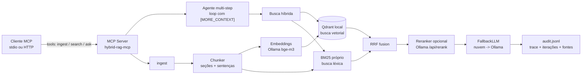

# hybrid-rag-mcp

[](https://github.com/brenol404/hybrid-rag-mcp/actions/workflows/ci.yml)
[](https://www.python.org/)
[](LICENSE)

> Serve MCP com **RAG híbrido** (Qdrant vetorial + BM25 léxico via RRF), **agente multi-step** com fallback offline via **Ollama** e transporte **stdio** ou **streamable HTTP**.

Foco: indexar documentos técnicos (Markdown, TXT, PDF) e responder perguntas com **fontes citadas**, de forma **100% local** — o padrão que conecta LLMs a bases locais/corporativas em 2026/2027.

## Destaques

- **Busca híbrida**: embedding (Qdrant local, sem Docker) + BM25 próprio (idf suavizado), fundidos por **RRF**.
- **Agente multi-step**: se o contexto da 1ª busca for insuficiente, o modelo sinaliza `[MORE_CONTEXT]`, o agente gera uma busca de follow-up e repete com **memória incremental de fontes**.
- **Re-ranking opcional**: cross-encoder (Ollama `/api/rerank`, ex. `bge-reranker-v2-m3`) com *degradação graciosa*.
- **Fallback resiliente**: provedor de nuvem (OpenAI-compatible) na frente, **Ollama local como reserva** quando a API cai.
- **Persistência**: os chunks ficam no Qdrant; o índice BM25 é **restaurado no startup** sem re-ingestão.
- **Ingestão incremental**: re-rodar `ingest` só embeda o que mudou (idempotente por hash de conteúdo) e poda órfãos — barato em CI e em re-deploys.
- **Otimização de tokens**: **cache semântico** (JSONL + cosseno, com TTL) devolve respostas já geradas sem re-chamar o LLM; **compressor estilo-Caveman** (PT/EN) enxuga o contexto de fontes antes do prompt.
- **Rastreabilidade**: `trace` por passo do agente + `audit.jsonl` (pergunta, provedor, iterações, latência, fontes, cache).
- **Mensurável**: pipeline de avaliação `recall@k` / `nDCG@k` com **gate de qualidade no CI**.
- **Dois transportes**: stdio (RPC local) e **streamable HTTP** (`http://host:port/mcp`).

## Arquitetura



## Métricas (gate de qualidade no CI)

Pipeline de avaliação sobre **36 queries** — 12 curadas manualmente em `eval/dataset.jsonl` + 24 geradas automaticamente de documentos reais (`eval/dataset.real.jsonl`, veja [Corpus](#corpus)).
Gatilho do CI: **falha se `recall@1 < 0.8`**.

| k  | recall@k | nDCG@k |
|----|----------|--------|
| 1  | **0.917** | 0.917 |
| 3  | **1.000** | 0.865 |
| 5  | **1.000** | 0.945 |

Números honestos sobre texto real: a fonte certa está no top-1 em 91,7% dos casos e sempre no top-3. `tools/grid_search.py` varre pesos RRF/top_k e chega a esse resultado (peso léxico 1.5) — histórico em `eval/grid_results.json`. Rode localmente com `python -m hybrid_rag_mcp.eval`.

## Qualidade das respostas (llm-as-judge)
Retrieval prova que o trecho certo sobe; isto prova que a resposta final está
correta: **12 perguntas** sobre o corpus (`eval/answers.jsonl`), cada uma com
resposta esperada, nota **0/1/2** dada pelo próprio Ollama — rode com
`python -m hybrid_rag_mcp.judge` (precisa do Ollama de pé).

| métrica | valor |
|---|---|
| média | **1.92** (0..2) |
| nota 2 | 11/12 |
| nota 1 | 1/12 (ans-06: faltou "telemetria não vai ao PostgreSQL") |
| nota 0 / sem veredito | 0 |

## Escala (retrieval, modo embarcado)

Metodologia (`tools/scale_bench.py`): 11 docs reais replicados com salt único
até ~25k chunks — recall continua no eval curado, aqui só **latência,
throughput e disco** (36 queries reais, sem LLM). Índice isolado, Qdrant
embarcado numa máquina de 4GB RAM.

| métrica | 32.760 chunks indexados |
|---|---|
| ingest | 566s (**58 chunks/s**), índice 337MB em disco |
| busca 1 thread | p50 269ms · p95 663ms · média 404ms |
| busca 8 threads | p50 1313ms · p95 2334ms |
| p99 single 4,4s | custo one-time de warmup (1ª busca restaura o BM25) |

Leituras honestas: o gargalo em escala é o **BM25 em Python puro** (varre todos
os docs por query) e a contenção sob concorrência (~5x com 8 threads — GIL +
Qdrant local + embedding no Ollama). Teto conhecido: com 128k chunks a máquina
tomou OOM — acima de ~100k chunks ou pouca RAM, usar o modo servidor
(`QDRANT_URL`, ver Deploy).

## Otimização de contexto (cache + compressão)

**Cache semântico** — antes de gerar, `ask` consulta `data/cache.jsonl` em duas camadas:
1. *normalização exata* (perguntas idênticas, ignorando caixa/espaços) e
2. *similaridade* — a pergunta é embedded (mesmo bge-m3 da busca) e comparada por
   cosseno com as entradas; acima de `CACHE_SIM_THRESHOLD` (0.92) devolve a resposta
   salva (TTL `CACHE_TTL_SEC`, limite `CACHE_MAX_ENTRIES`). Um hit pula a geração
   inteira — é o maior corte de tokens. Hits são marcados `· cache` na resposta e
   registrados no audit (`"cache": true`).

**Compressão de contexto (estilo-Caveman)** — `CONTEXT_COMPRESSION` (0/1/2) remove
palavras de função previsíveis (conectivos/enchimentos no nível 1; + artigos e
auxiliares no nível 2) **apenas da cópia que vai para o prompt** do LLM: a busca, o
re-ranking e as fontes exibidas continuam com o texto original, e números, nomes
próprios e negações nunca são removidos. Determinística, multilíngue (PT/EN), zero
dependências.

```bash
python tools/optimizers_report.py        # painel: cache + compressão + integrações avaliadas
python tools/optimizers_report.py --json # mesma saída em JSON
```

**Integrações externas avaliadas — mantidas opcionais (nada entra no core):**

| Ferramenta | Onde atuaria | Veredito |
|---|---|---|
| [Headroom](https://github.com/headroomlabs-ai/headroom) | compressão reversível de contexto/tool outputs/RAG chunks; lib Python + MCP server próprios | adotável futuramente como sidecar MCP; carga ONNX/HF (`pip install headroom`) |
| [RTK](https://github.com/rtk-ai/rtk) | compressão de saída de shell para agentes de coding | fora do runtime — recomendado no ambiente de dev |
| [Caveman](https://github.com/wilpel/caveman-compression) | princípio "tirar gramática, manter fatos" (PT incluso) | **já embutido** em `CONTEXT_COMPRESSION` |
| [Ponytail](https://github.com/DietrichGebert/ponytail) | cortar volume de código gerado por agentes | não se aplica a um servidor RAG |

## Corpus

- `examples/corpus/` — **11 documentos**: 5 fictícios (operations/security/database/infra/events) + 6 livros reais de domínio público (Project Gutenberg): Chekhov, Machado de Assis, Aluísio Azevedo, Eça de Queirós, Jane Austen e Conan Doyle, misturando PT e EN.
- `tools/fetch_corpus.py` — baixa o catálogo do Gutenberg e **gera o dataset de avaliação automaticamente**: cada consulta é um trecho real do documento e o documento esperado é a fonte exata desse trecho (ground-truth auto-supervisionado, sem curadoria manual).

## Como rodar

Pré-requisitos: **Python 3.11+**, **Ollama** de pé (`ollama serve`).

```bash
# 1. Modelos locais (uma vez)
ollama pull bge-m3        # embeddings
ollama pull qwen3:8b      # geração (ou outro)
ollama pull bge-reranker-v2-m3   # opcional: somente Ollama >= 0.36

# 2. Instalar
python -m venv .venv && source .venv/bin/activate
pip install -e ".[dev]"

# 3. Demo de ~1 min (ingest + search + ask)
bash examples/demo.sh
```

<details>
<summary>Saída real da demo (Ollama local, corpus de exemplo)</summary>

```
[ingest] 11 docs, 1964 chunks (+0 novos, 1964 no índice)
[search] 'Qual a porta padrão do servidor?'
  - [pqpbr-operations.txt] score=0.065: ## Configuração de Rede O servidor escuta na porta 8443...
[ask] 'De quantas em quantas horas são os backups?'
  [ollama/qwen3:8b] Os backups incrementais são executados a cada 4 horas [pqpbr-operations.txt].
  fontes: gutenberg-dom-casmurro.txt, pqpbr-operations.txt
```

</details>

### Como cliente MCP

**stdio:** cliente de exemplo — `python examples/client.py "Qual a porta padrão?"`

**Streaming de progresso (tokens + etapas):**
`python examples/client_stream.py "Qual a política de manutenção do banco?"` — o servidor
emite eventos de etapa e tokens da resposta em tempo real via `notifications/progress`
(o cliente envia um `progressToken` no request).

**HTTP:**

```bash
# terminal 1
python -m hybrid_rag_mcp --transport http --host 127.0.0.1 --port 8000

# terminal 2
python examples/client_http.py "Qual a porta padrão?"
```

**Auth no HTTP (recomendado ao expor na rede):** gere um token
(`openssl rand -hex 32`), exporte `MCP_AUTH_TOKEN` no servidor **e** no
cliente — sem o header `Authorization: Bearer` o servidor responde 401.
Sem token configurado, comporta-se como antes (só use em localhost).

```
MCP_AUTH_TOKEN=... python -m hybrid_rag_mcp --transport http --port 8000
MCP_AUTH_TOKEN=... python examples/client_http.py "Qual a porta padrão?"

Registre em qualquer cliente MCP (Claude Desktop, editores, agentes):

```json
{
  "mcpServers": {
    "hybrid-rag": {
      "command": ".venv/bin/python",
      "args": ["-m", "hybrid_rag_mcp"],
      "env": { "PYTHONPATH": "src" }
    }
  }
}
```

### Fallback para nuvem (opcional)

Copie `.env.example` para `.env` e preencha `CLOUD_BASE_URL` + `CLOUD_API_KEY` + `CLOUD_MODEL`
(qualquer endpoint OpenAI-compatível). A nuvem assume prioridade; o Ollama responde automaticamente
se a API falhar ou ficar offline.

## Deploy

**systemd (bare metal):** `deploy/hybrid-rag.service` é uma user unit que sobe o
transporte HTTP em `127.0.0.1:8000` com restart automático — ajuste os caminhos
(`%h` = seu home) e instale com
`systemctl --user enable --now` apontando para o arquivo. O `.env` é opcional
(nuvem/token só se você exportar).

**Docker (Qdrant + RAG):** `docker compose up -d --build` sobe o Qdrant e o
servidor já apontado para ele (`QDRANT_URL=http://qdrant:6333`, Ollama via
`host.docker.internal`). Sem Docker instalado aqui o compose não foi executado
localmente — validado por inspeção; o CI continua cobrindo o modo embarcado.

**Higiene de dados:** o `audit.jsonl` rotaciona por tamanho
(`AUDIT_MAX_BYTES`, default 5MB, mantém `AUDIT_KEEP=3` backups); o cache
semântico já é limitado (`CACHE_MAX_ENTRIES`).

## Ferramentas MCP

| Tool    | Descrição |
|---------|-----------|
| `ingest` | Indexa `md`/`txt`/`pdf` de um diretório nos dois índices (Qdrant + BM25). Incremental: só re-embeda chunks alterados. |
| `search` | Busca híbrida (RRF, com re-ranking opcional) retornando trechos + fontes. |
| `ask`    | Agente multi-step: recupera, gera, detecta contexto insuficiente, refaz a busca e responde citando fontes (com audit log). Consulta o **cache semântico** antes de gerar. |

## Estrutura

```
src/hybrid_rag_mcp/
├── server.py          # Servidor MCP (stdio + streamable HTTP, auth bearer opcional)
├── config.py          # Configuração via .env (pydantic-settings)
├── eval.py            # Avaliação recall@k / nDCG@k
├── judge.py           # Avaliação de respostas via llm-as-judge (NOTA 0/1/2)
├── rag/
│   ├── agent.py       # Loop multi-step (memória de fontes, [MORE_CONTEXT])
│   ├── chunker.py     # Chunking por seções markdown + sentenças
│   ├── engine.py      # Orquestração: ingest → search → ask + audit
│   ├── hybrid.py      # Fusão RRF + re-ranking
│   └── ingestion.py   # Leitura de md/txt/pdf
├── providers/
│   ├── embed.py       # Embeddings via Ollama
│   ├── llm.py         # FallbackLLM (nuvem → Ollama)
│   └── rerank.py      # Cross-encoder opcional (degradação graciosa)
├── optimize/
│   ├── cache.py       # Cache semântico (JSONL + cosseno + TTL)
│   └── compress.py    # Compressor estilo-Caveman (PT/EN)
└── stores/
    ├── vector.py      # Qdrant embarcado (sem Docker, persistente)
    └── lexic.py       # BM25 com idf suavizado
```

Decisões de arquitetura com contexto e evidência: [`docs/adr/`](docs/adr/)
(RRF, storage, cache, juiz, lazy-init). Guia de contribuição: [CONTRIBUTING.md](CONTRIBUTING.md).
Histórico de releases: [CHANGELOG.md](CHANGELOG.md).

## Qualidade

- **66 testes unitários** (`pytest`) sem rede/Ollama — chunking, RRF, BM25, persistência, métricas de eval, loop do agente, cache semântico, compressor, thread-safety do índice léxico, parsing/agregação do juiz, auth HTTP e rotação do audit.
- CI em 3 frentes: `test` (ruff + **mypy strict** + pytest com cobertura ≥75% + `pip-audit` + smoke stdio/HTTP) e `eval` (Ollama real + gate `recall@1 >= 0.8`). Dependabot semanal (pip + actions).
- Dois modos de storage: **embarcado** (default, sem Docker, 1 processo por vez) ou
  **servidor** (`docker compose up -d` + `QDRANT_URL=http://localhost:6333`) para
  sessões simultâneas — ver `docker-compose.yml`.