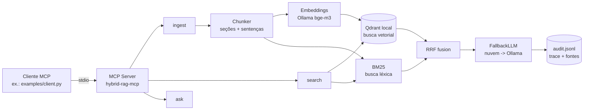

# hybrid-rag-mcp

Agente local orientado a tarefas com **RAG híbrido** (busca vetorial + BM25) exposto via **[Model Context Protocol (MCP)](https://modelcontextprotocol.io)** e **fallback offline** via **[Ollama](https://ollama.com)**.

Foco: indexar documentos técnicos (Markdown, TXT, PDF) e responder perguntas com fontes citadas — o mesmo padrão que conecta LLMs a bases locais/corporativas em 2026/2027.

## Por que esse projeto existe

- **MCP** padronizou como agentes acessam dados locais — este servidor é um exemplo pronto.
- **RAG híbrido** *(vetorial + léxico)* supera RAG só-semântico: BM25 captura termos exatos, vetores capturam sentido.
- **Execução 100% local** (Qdrant em modo embarcado + Ollama): zero custo de nuvem e privacidade dos dados.
- **Fallback resiliente**: se um provedor de nuvem estiver configurado, o sistema usa-o e cai automaticamente para o modelo local quando a rede/API falhar.
- **Rastreabilidade**: cada consulta gera um `trace` e registros em `audit.jsonl` (quem perguntou o quê, provedor usado, latência).

## Arquitetura



## Como rodar

Pré-requisitos: **Python 3.11+**, **Ollama** rodando (`ollama serve`).

```bash
# 1. Modelos locais (uma vez)
ollama pull bge-m3        # embeddings
ollama pull qwen3:8b      # geração (ou outro modelo)

# 2. Instalar
python -m venv .venv && source .venv/bin/activate
pip install -e ".[dev]"

# 3. Usar direto pela engine (Python)
python -c "
from hybrid_rag_mcp.rag.engine import RAGEngine
rag = RAGEngine()
print(rag.ingest())                                  # indexa examples/corpus
print(rag.search('Qual a porta padrão do servidor?')) # busca híbrida
print(rag.ask('Em quantas horas são os backups?'))    # resposta com fontes
"
```

### Como cliente MCP

O servidor fala o protocolo MCP pela stdio. Use o client de exemplo:

```bash
python examples/client.py "Qual a porta padrão do servidor?"
```

Ou registre em qualquer cliente MCP (Claude Desktop, editores, agentes):

```json
{
  "mcpServers": {
    "hybrid-rag": {
      "command": ".venv/bin/python",
      "args": ["-m", "hybrid_rag_mcp"],
      "env": { "PYTHONPATH": "src" }
    }
  }
}
```

### Fallback para nuvem (opcional)

Copie `.env.example` para `.env` e preencha `CLOUD_BASE_URL` + `CLOUD_API_KEY` +
`CLOUD_MODEL` (qualquer endpoint OpenAI-compatível). O provedor de nuvem assume a
prioridade e o Ollama fica como reserva automática se a API falhar ou ficar offline.

## Ferramentas MCP

| Tool    | Descrição |
|---------|-----------|
| `ingest` | Indexa documentos `md`/`txt`/`pdf` de um diretório nos dois índices. |
| `search` | Busca híbrida (RRF) e retorna trechos + fontes. |
| `ask`    | RAG completo: recupera contexto e gera resposta com fontes citadas e audit log. |

## Estrutura

```
src/hybrid_rag_mcp/
├── server.py          # Servidor MCP (tools: ingest, search, ask)
├── config.py          # Configuração via .env (pydantic-settings)
├── rag/
│   ├── chunker.py     # Chunking por seções markdown + sentenças
│   ├── hybrid.py      # Fusão RRF (vetorial + léxico)
│   ├── engine.py      # Orquestração: ingest → search → ask + audit
│   └── ingestion.py   # Leitura de md/txt/pdf
├── providers/
│   ├── embed.py       # Embeddings via Ollama
│   └── llm.py         # FallbackLLM (nuvem → Ollama)
└── stores/
    ├── vector.py      # Qdrant embarcado (sem Docker)
    └── lexic.py       # BM25 próprio (idf suavizado, sem deps)
```

## Qualidade

- Testes unitários (`pytest`) sem dependência de rede ou Ollama.
- CI via GitHub Actions: `pytest` + `ruff` (lint + format) + smoke test do MCP server.
- `docker-compose.yml` intencionalmente ausente: funciona só com `pip install` (Qdrant embarcado).